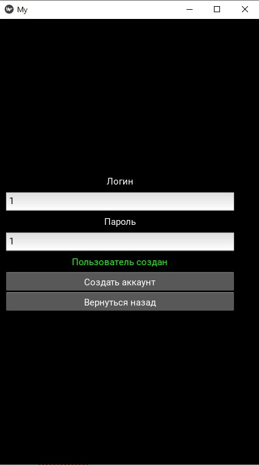

**Проект "Мобильное приложение для изучения иностранных слов"**

---

**Описание:**
Данное мобильное приложение предоставляет возможность пользователям изучать иностранные слова путем выбора правильного перевода и выполнения практических заданий. Приложение оснащено системой регистрации и входа, а также имеет административный интерфейс для добавления новых слов.

  
---

**Функционал:**
- Страница регистрации и входа с обработкой возможных ошибок (например, уже существующий логин или пустая строка).
- База данных для хранения пользователей и их паролей (в настоящее время без хэширования паролей).
- Главное меню с возможностью обучения словам и выполнения практических заданий.
- Уроки с возможностью перевода на английский и русский языки.
- Административный интерфейс (доступ по логину "admin" и паролю "admin") для добавления новых слов.
- Сохранение входа, позволяющее пользователям оставаться в системе при последующих входах.

  

---

**Минусы:**
- Отсутствие хэширования паролей.
- Иногда не появляется клавиатура при вводе пароля с телефона.
- Структура кода написана с определенной спешкой для соблюдения сроков.

---

**Инструкции по установке и использованию:**
- 'make venv' и 'make venv_run' для запуска приложения в виртульном окружении Python.
- 'make global' и 'make global_run' для запуска приложения глобально.

---

**Галлерея**

- Практические задачи и изучение слов

  

